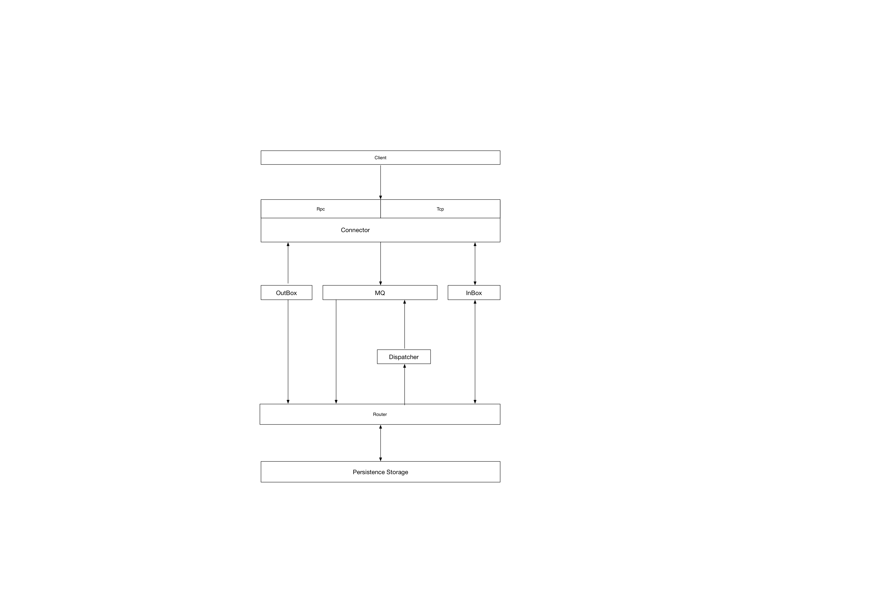
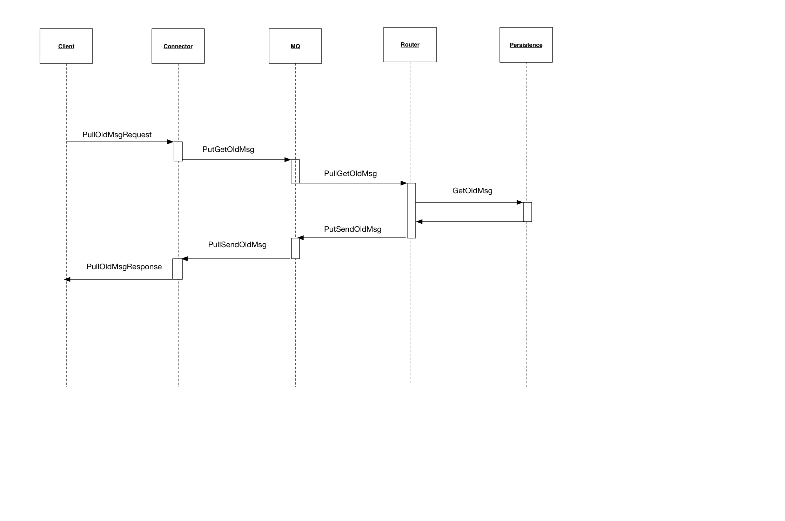
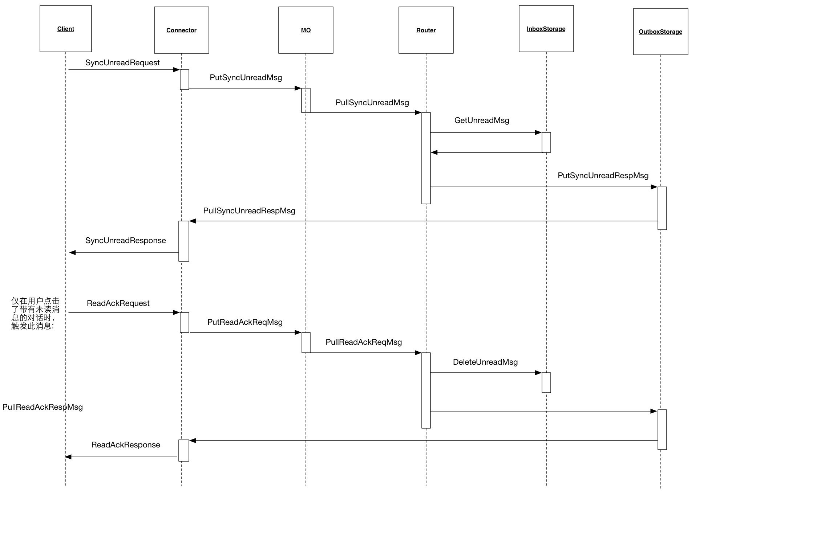

# linbox_server

LINBOX is a im system designed for www.medtree.cn.

Download medtree app for iphone at [here](https://itunes.apple.com/cn/app/yi-shu/id933709180?mt=8)

Download medtree app for android at [here](https://medtree.cn/release/android/4.1.1/medtree.apk)

# Tech
* Netty and tcp protocol
* Kafka as center MQ
* Dubbo as rpc framework

# Usage
Build the project:
```
gradle zip
```

distribution package is under 
```
build/distribution/linbox_server-1.0.zip
```

Unzip it and start the server:
```
# start the tcp client:
sh tcpServer.sh

# start the router:
sh consumer.sh

# start the rpc client
sh rpcServer.sh
```

# Dependencies
## Java Version
**JDK-1.8** is required to build and run it.

## Security Update For JRE
**Be carefual:** as we use AES-256 encryption, you need to download packages to update your local jre environment.
* Download package at [here](http://www.oracle.com/technetwork/java/javase/downloads/jce8-download-2133166.html)
* Unzip and copy the jars into ```${java.home}/jre/lib/security/```

Click [this](http://stackoverflow.com/questions/6481627/java-security-illegal-key-size-or-default-parameters) for detail information for this problem.

## Mysql
Mysql database is used as persistence storage for im messages.

### Mysql Versions
There is no special requirement for mysql version.
But if you want to use **emojis**, you need to use mysql version **5.6+**, and config the character set to *utf8mb4*.

### Predefined Tables
You can find all mysql operations in package ```com.linbox.im.server.storage```

There are 4 tables predefined in programs, sql script could be find in [mysql.sql](src/main/docs/mysql.sql)

## Configs
Config mysql connection in [im.properties](src/main/config/im.properties)

## Redis
Config redis connection in [im.properties](src/main/config/im.properties)

## Zookeeper
Zookeeper is used as config center of the project. It is also a dependency of *dubbo* and *Kafka*.
Config Zookeeper in [rpc.xml](src/main/config/spring/rpc.xml)

## Kafka
Kafka is used as Center MQ.
Kafka is configd in [im.properties](src/main/config/im.properties)


# Architecture



# Communication Protocol
Linbox use tcp protocal and JSON structure in communication.
Data package structure is designed as below:

|Version|Type|Length|Content|
|-----|-----|----|------|
|2 Byte|2 Byte|4 Byte|JSON String|


|Name|Description|
|:--|:--|
|Version| A flag to show the protocol version of the package|
|Type| Request / Response command type|
|Length| The length of the content part|
|Content| Encrypted Data content structured in json|


# Main Communications 
## Get history messages



## Get unread count and messages



## Send messages


